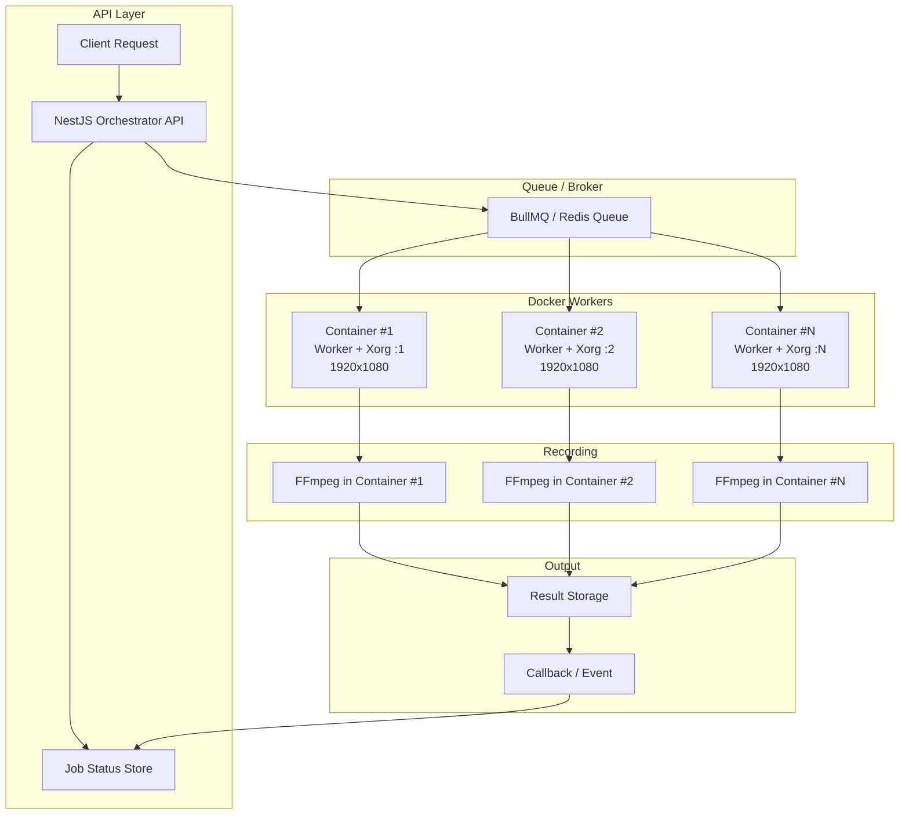

# 진하늘 이력서

## Summary

지도 기반 서비스와 관리 시스템을 중심으로 프론트엔드 개발 경험을 쌓아온 개발자입니다.

React, Next.js 기반 UI 개발뿐 아니라 Google Maps, Naver Maps, Mapbox GL 등 다양한 지도 provider를 다루며 지도 시각화와 사용자 인터랙션을 구현해왔습니다.

Puppeteer 기반 브라우저 자동화, WebGL 실행 환경 구성, Ollama 기반 AI 기능 적용 등 서비스 운영에 필요한 문제를 직접 해결해왔습니다. 기획이 구체화되지 않은 단계에서도 요구사항을 정리하고, 화면 구조와 기능 흐름을 먼저 구현해 제품 방향을 빠르게 검증하는 방식으로 일해왔습니다.

---

## Education

**공주대학교 컴퓨터공학과 중퇴**  
2011.03 ~ 2015.02

---

## Tech Stack

- **Frontend**: React, Next.js, Vite, Redux Toolkit, TypeScript
- **UI**: Material UI, Emotion.js
- **Visualization**: Google Maps, Naver Maps, Mapbox GL, MapLibre GL, Three.js, WebGL
- **AI**: Ollama
- **Automation**: Puppeteer
- **Backend**: NestJS, Node.js, Express, Spring Boot
- **Infra / DevOps**: Docker, Nginx, Apache2, Linux, AWS EC2, AWS S3
- **Etc**: WebSocket, Redis

---

## Experience

### 시터스(CITUS)

**2019.06 ~ 현재 (6년 11개월)**

지도 기반 서비스 및 관리 시스템 개발

**주요 업무**

- React + Vite 기반 관리자 페이지 설계 및 개발
- GPX 기반 지도 시각화 및 데이터 처리 기능 구현
- Redux 기반 상태 관리 구조 설계
- 기존 Jenkins 기반 배포 프로세스를 GitLab CI로 통합

**성과**

- 대용량 지도 데이터 처리 및 렌더링 구조 개선
- 지도 이동, 확대/축소 등 주요 사용자 인터랙션 응답성 개선
- Jenkins 기반 배포 흐름을 GitLab CI로 일원화하여 배포 자동화 구조 개선

---

## Projects

### 더트레일(The Trail)

**지도 기반 아웃도어 트래킹 및 콘텐츠 생성 서비스**  
2025.09 ~ 현재 (8개월)  
[https://thetrail.co.kr/](https://thetrail.co.kr/)

GPX 데이터를 기반으로 사용자 트래킹 경로를 시각화하고, 이를 영상 콘텐츠로 생성할 수 있는 지도 기반 서비스입니다. 지도 탐색, 활동 기록, 드론 영상 생성, 커뮤니티 피드 기능을 제공하며 GeoJSON 기반 지도 데이터 처리와 GPX 파일 업로드를 지원합니다.

사용자 웹

**주요 구현**

- Next.js 기반 사용자 웹 서비스 개발
- Google Maps, Naver Maps, Mapbox GL을 전환해 사용할 수 있는 지도 provider 구조 설계
- 지도 provider별 API 차이를 고려한 지도 UI 및 인터랙션 구현
- GPX 데이터 파싱 및 커스텀 확장 데이터 처리

**기술**

- Next.js, React, TypeScript, Google Maps, Naver Maps, Mapbox GL

**성과**

- 여러 지도 provider의 API 차이를 흡수하여 동일한 사용자 흐름에서 전환 가능한 구조 마련
- GPX 업로드부터 지도 경로 시각화까지 이어지는 핵심 사용자 흐름 구현
- 지도 렌더링 및 인터랙션 응답성 개선

관리자 페이지

**주요 구현**

- React + Vite 기반 관리자 페이지 설계 및 개발
- 데이터 관리 및 콘텐츠 제어 기능 구현
- Ollama 기반 사용자 콘텐츠 검수 기능을 구현하여 게시글·댓글의 부적절 표현을 사전 탐지
- 공지사항 및 게시판 작성 화면에 AI 기반 글쓰기 보조 기능을 적용하여 운영자의 콘텐츠 작성 흐름 개선
- 구체화되지 않은 요구사항을 구조화하여 관리자 UI 및 기능 흐름 설계
- 빠른 화면 구현을 통해 기획 의도를 구체화하고 기획과 개발 간 협업 흐름 개선

**기술**

- React, Vite, Redux Toolkit, Ollama

**성과**

- 데이터 관리, 콘텐츠 제어, AI 보조 기능을 관리자 화면에 통합하여 운영 흐름 개선

지도 기반 영상 생성 자동화 시스템

[예시 영상](https://the-trails.s3.ap-northeast-2.amazonaws.com/videos/2026/4/8647.mp4)

**아키텍처 다이어그램**

**주요 구현**

- NestJS 기반 Orchestrator API를 통해 녹화 요청을 관리하고, BullMQ 기반 작업 큐로 워커를 제어하는 구조 설계
- React + Mapbox GL 기반 지도 화면에 사용자 GPX 기록을 렌더링하고, 경로 애니메이션 재생 기능 구현
- Puppeteer 기반 브라우저 자동화로 지도 애니메이션 재생 흐름 제어
- FFmpeg을 활용하여 지도 애니메이션 재생 화면을 영상 파일로 녹화 및 인코딩
- 워커 기반 병렬 처리 구조를 통해 다수의 녹화 작업을 비동기적으로 분산 처리
- 서버 환경에서 WebGL 실행을 위한 Xorg 및 GPU 렌더링 환경 구성

**기술**

- NestJS, Node.js, BullMQ, Redis
- React, Mapbox GL, WebGL
- Puppeteer, FFmpeg
- Docker, Linux, Xorg

**성과**

- 사용자 GPX 기록 기반 지도 애니메이션을 서버에서 자동으로 영상화하는 처리 흐름 구현
- BullMQ 기반 큐 구조를 통해 영상 생성 작업 처리 안정성 및 확장성 확보
- 병렬 처리 구조 도입으로 대량 영상 생성 처리 효율 개선
- 서버 환경에서 WebGL 기반 지도 렌더링 및 영상 녹화 처리 안정화

지도 기반 미리보기 이미지 생성기

**주요 구현**

- Redis Consumer 기반 작업 처리 구조로 사용자 트랙 미리보기 생성 요청 처리
- 사용자 트랙을 지도 위에 렌더링하고 피드 및 공유 화면에 사용할 미리보기 이미지 생성
- Puppeteer 기반 브라우저 자동화로 지도 화면 렌더링 및 스크린샷 캡처 흐름 제어
- 지도 스타일, 트랙 경로, 표시 영역을 조합하여 일관된 미리보기 화면 구성

**기술**

- Node.js, Redis
- React, Mapbox GL, WebGL
- Puppeteer

**성과**

- 사용자 트랙 기반 콘텐츠를 시각적으로 확인할 수 있는 미리보기 생성 흐름 구축
- 피드 및 공유 화면에서 사용할 지도 기반 썸네일 이미지 생성 자동화

---

### 루센 네비게이션 웹

**Android 및 iOS WebView에 탑재된 차량용 지도 및 주행 안내 서비스**  
2024.04 ~ 2024.10 (7개월)

Android 및 iOS 앱의 WebView에 탑재되어 차량 주행 상황에서 사용할 수 있는 웹 기반 내비게이션 서비스입니다. MapLibre.js 기반 지도 화면에서 경로와 현재 위치를 표시하고, 주행 안내에 필요한 정보를 제공하는 인터페이스를 구현했습니다.

**주요 구현**

- MapLibre.js 기반 차량용 지도 화면 및 주행 안내 UI 구현
- Android 및 iOS WebView 환경에 맞춘 화면 구성 및 동작 처리
- GPS 기반 현재 위치 추적 및 지도 중심 이동 처리
- 주행 경로, 안내 정보, 현재 위치를 함께 표시하는 내비게이션 화면 구성
- 차량 주행 상황에 맞춘 지도 인터랙션 및 화면 흐름 구현

**기술**

- React, TypeScript, MapLibre.js, Android WebView, iOS WebView

**성과**

- 모바일 앱 WebView 환경에서 차량용 내비게이션 흐름을 사용할 수 있는 지도 기반 UI 구현
- 실시간 위치 변화에 맞춰 지도 화면과 안내 정보를 갱신하는 사용자 흐름 구축

---

## Open Source

### @rousen/react-naver-maps

**React용 Naver Maps Wrapper 라이브러리**

- [npm](https://www.npmjs.com/package/@rousen/react-naver-maps)
- [문서](https://knsan189.github.io/react-naver-maps/)
- [GitHub](https://github.com/knsan189/react-naver-maps)

기존 Naver Maps JavaScript API가 React 컴포넌트 방식의 공식 wrapper를 제공하지 않아, React 환경에서 선언형으로 지도를 사용할 수 있도록 만든 라이브러리입니다.

**주요 구현**

- Naver Maps JavaScript API를 React 컴포넌트 구조로 래핑
- 지도, 마커, 오버레이 기능을 선언형 컴포넌트 API로 설계
- TypeScript 기반 타입 정의 및 사용성 개선
- Rollup.js 기반 번들링 환경을 구성하여 npm 배포 가능한 라이브러리 패키지로 관리
- npm 패키지 배포 및 버전 관리
- GitHub Pages 기반 문서 사이트 구축 및 사용 가이드 제공

**기술**

- React, TypeScript, Naver Maps API, Rollup.js

**성과**

- React 환경에서 Naver Maps 기능을 재사용 가능한 컴포넌트 구조로 추상화
- 지도, 마커, 오버레이 연동 시 반복되는 구현 코드 감소
- npm 패키지와 문서 사이트를 함께 제공하여 외부 사용자가 설치부터 사용까지 이어갈 수 있는 환경 마련

---

## SI Projects

### 소방대원 실내 위치 추정 및 관제 시스템

**2025.04.01 ~ 현재 (1년 1개월)**

**SI 프로젝트 대표 사례**

화재 현장과 같은 실내 환경에서 건물 도면을 2D 지도와 3D 공간으로 시각화하고, 소방대원의 위치를 매핑하여 실시간으로 모니터링할 수 있는 관제 시스템입니다.

**주요 구현**

- Electron 기반 데스크톱 모니터링 애플리케이션 설계 및 개발
- React 기반 UI 구성 및 상태 관리 설계
- 건물 도면 데이터를 2D 지도 및 3D 공간으로 시각화하고 사용자 위치 매핑 기능 구현
- Three.js를 활용한 3D 공간 시각화 및 소방대원 위치 표현
- MapLibre GL 기반 지도 시각화 및 위치 데이터 연동
- 실시간 위치 데이터 반영을 위한 데이터 처리 및 렌더링 최적화

**기술**

- Electron, React, Three.js, MapLibre GL
- JavaScript, TypeScript

**성과**

- 실내 환경에서 소방대원 위치를 직관적으로 파악할 수 있는 관제 화면 구현
- 2D 지도와 3D 시각화를 결합하여 현장 위치 정보를 다각도로 확인할 수 있는 모니터링 환경 구축
- 실시간 위치 데이터 반영 시 렌더링 부담을 줄이는 화면 갱신 구조 구현

---

### 정밀주소 플랫폼 기반 재난 응급상황 신고·출동 서비스

**2023.04.01 ~ 2025.12.31 (2년 9개월)**

**SI 프로젝트 대표 사례**

정밀주소 기반으로 재난 상황 발생 시 신고 접수 및 출동을 지원하는 시스템입니다. 영상 통화를 통해 현장 상황을 실시간으로 전달할 수 있는 서비스를 제공했습니다.

**주요 구현**

- WebRTC 기반 영상 통화 서버(Jitsi) 구축 및 운영 환경 구성
- 신고자 Android 앱 WebView에서 사용할 영상 통화 UI 페이지 개발
- 관리자 페이지에서 신고, 출동, 영상 통화 관리 기능을 설계부터 구현까지 단독 수행
- 기능 흐름 및 UI 구조를 직접 설계하여 운영 요구사항을 반영한 관리 시스템 구축
- 영상 통화 세션 연결 및 상태 처리 로직 구현

**기술**

- Jitsi, WebRTC, React, JavaScript
- Android WebView
- Node.js

**성과**

- 영상 통화 기반 신고 기능을 통해 현장 상황을 실시간으로 확인할 수 있는 대응 흐름 구현
- 신고, 출동, 영상 통화 관리를 하나의 관리자 화면에서 처리할 수 있는 운영 환경 구축

---

### 기타 프로젝트

다양한 기업 및 공공기관 대상 웹 서비스 및 관리 시스템 개발에 참여했습니다.

- React 기반 관리자 페이지 및 사용자 웹 개발
- REST API 연동 및 데이터 처리 로직 구현
- 기존 레거시 코드 개선 및 기능 리팩토링 수행
