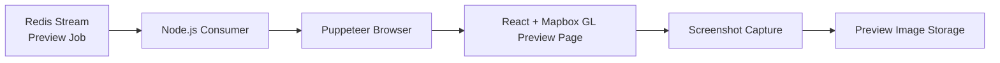

# 지도 기반 미리보기 이미지 생성기

사용자 트랙을 지도 위에 렌더링하고, 피드 및 공유 화면에서 사용할 미리보기 이미지를 생성하는 자동화 기능입니다.

사용자가 업로드하거나 기록한 트랙은 GPX/GeoJSON 형태의 경로 데이터로만 존재하기 때문에, 피드 목록이나 공유 화면에서 내용을 직관적으로 보여주기 어렵습니다. 이 기능은 트랙 경로를 지도 위에 올리고, provider별 지도 스타일과 표시 영역을 조합해 일관된 썸네일 이미지를 생성합니다.

미리보기 생성 요청은 Redis Stream을 통해 비동기 작업으로 전달되며, Consumer가 Puppeteer 브라우저를 실행해 지도 화면을 렌더링한 뒤 스크린샷을 캡처합니다. 이를 통해 사용자가 직접 이미지를 만들지 않아도 트랙 기반 콘텐츠에 사용할 대표 이미지를 자동으로 생성할 수 있습니다.

## 예시 이미지

| Google Maps 기반 미리보기 | Naver Maps 기반 미리보기 |
| --- | --- |
|  |  |

## 아키텍처

## 주요 구현

- Redis Stream Consumer 기반 작업 처리 구조로 사용자 트랙 미리보기 생성 요청 처리
- 사용자 트랙을 지도 위에 렌더링하고 피드 및 공유 화면에 사용할 대표 이미지 생성
- Google Maps, Naver Maps 등 provider별 지도 스타일을 적용한 미리보기 이미지 생성
- Puppeteer 기반 브라우저 자동화로 지도 화면 렌더링 및 스크린샷 캡처 흐름 제어
- 지도 스타일, 트랙 경로, 표시 영역을 조합하여 일관된 미리보기 화면 구성

## 기술

- Node.js, Redis Streams
- React, Mapbox GL, WebGL
- Puppeteer

## 성과

- 사용자 트랙 기반 콘텐츠를 시각적으로 확인할 수 있는 미리보기 생성 흐름 구축
- 피드 및 공유 화면에서 사용할 지도 기반 썸네일 이미지 생성 자동화
