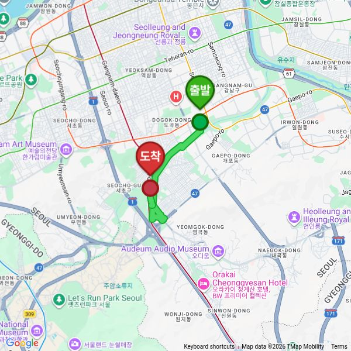
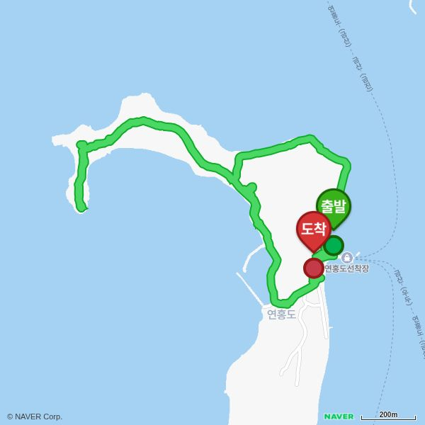
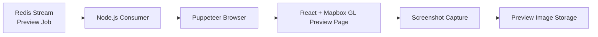

# 지도 기반 미리보기 이미지 생성기

사용자 트랙을 지도 위에 렌더링하고, 피드 및 공유 화면에서 사용할 미리보기 이미지를 생성하는 자동화 기능입니다.

## 예시 이미지

| Google Maps 기반 미리보기 | Naver Maps 기반 미리보기 |
| --- | --- |
|  |  |

## 아키텍처

## 주요 구현

- Redis Stream Consumer 기반 작업 처리 구조로 사용자 트랙 미리보기 생성 요청 처리
- 사용자 트랙을 지도 위에 렌더링하고 피드 및 공유 화면에 사용할 미리보기 이미지 생성
- Puppeteer 기반 브라우저 자동화로 지도 화면 렌더링 및 스크린샷 캡처 흐름 제어
- 지도 스타일, 트랙 경로, 표시 영역을 조합하여 일관된 미리보기 화면 구성

## 기술

- Node.js, Redis Streams
- React, Mapbox GL, WebGL
- Puppeteer

## 성과

- 사용자 트랙 기반 콘텐츠를 시각적으로 확인할 수 있는 미리보기 생성 흐름 구축
- 피드 및 공유 화면에서 사용할 지도 기반 썸네일 이미지 생성 자동화
