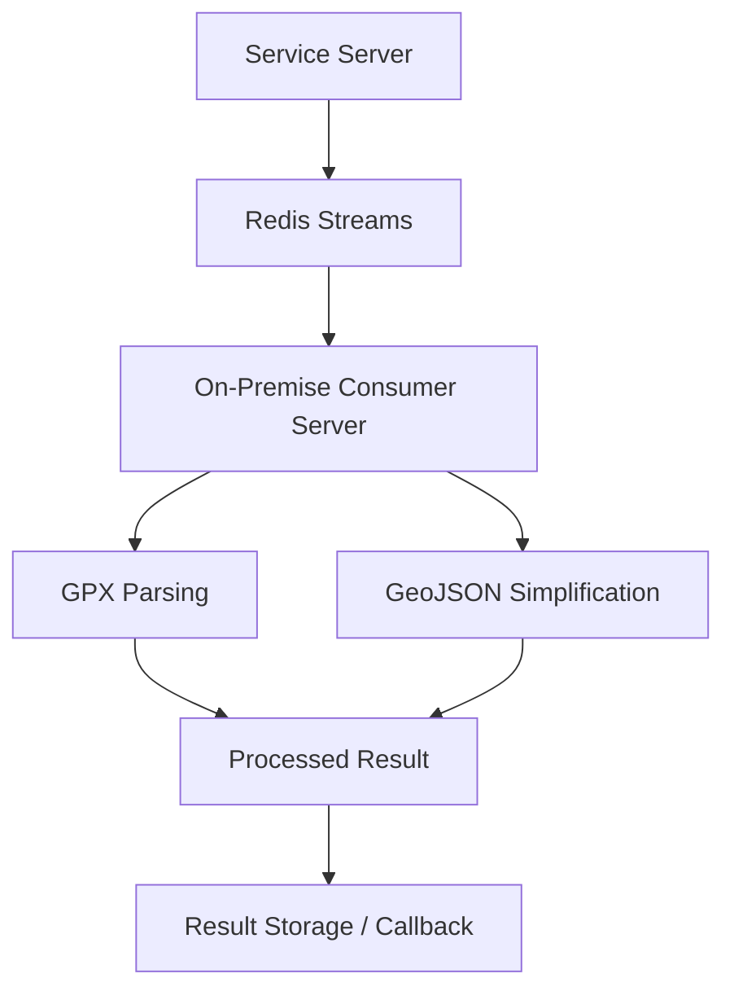

# Redis Stream Consumer 기반 고부하 처리 서버 운영

서비스 서버에서 직접 처리하기 부담이 큰 GPX 파싱 및 GeoJSON 단순화 작업을 Redis Stream Consumer 기반 처리 서버로 분리한 운영 구조입니다.

## 아키텍처

## 주요 구현

- Redis Stream Consumer 역할의 고부하 처리 서버를 사내 온프레미스 환경에서 운영
- EC2 비용과 처리 부하를 고려해 리소스 사용량이 큰 작업을 온프레미스 처리 서버로 분리
- GPX 파싱 및 GeoJSON 단순화 작업을 Redis Stream 기반으로 수신하고 처리하는 흐름 구성
- 온프레미스 처리 서버의 실행 환경과 운영 흐름 구성

## 기술

- Node.js, Redis Streams
- AWS EC2, AWS S3
- Linux, Docker

## 성과

- Redis Stream Consumer 기반 처리 구조로 GPX 파싱 및 GeoJSON 단순화 작업을 서비스 서버와 분리
- 고부하 처리 작업을 온프레미스 서버에서 수행하여 클라우드 비용 부담 완화
