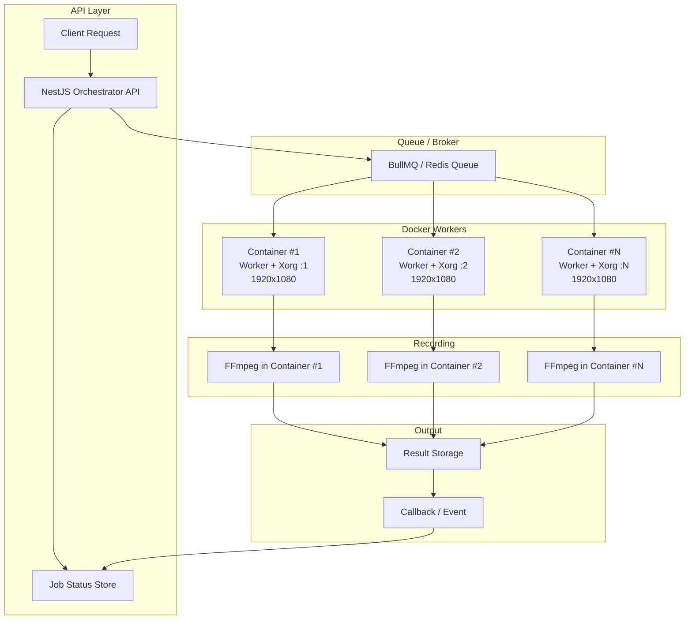

# 지도 기반 영상 생성 자동화 시스템

[예시 영상](https://the-trails.s3.ap-northeast-2.amazonaws.com/videos/2026/4/8647.mp4)

사용자 GPX 기록을 React + Mapbox GL 기반 지도 화면에 렌더링하고, 경로 애니메이션을 재생한 뒤 FFmpeg으로 영상 파일을 생성하는 자동화 시스템입니다.

## 아키텍처

## 주요 구현

- NestJS 기반 Orchestrator API를 통해 녹화 요청을 관리하고, BullMQ 기반 작업 큐로 워커를 제어하는 구조 설계
- React + Mapbox GL 기반 지도 화면에 사용자 GPX 기록을 렌더링하고, 경로 애니메이션 재생 기능 구현
- Puppeteer 기반 브라우저 자동화로 지도 애니메이션 재생 흐름 제어
- FFmpeg을 활용하여 지도 애니메이션 재생 화면을 영상 파일로 녹화 및 인코딩
- 워커 기반 병렬 처리 구조를 통해 다수의 녹화 작업을 비동기적으로 분산 처리
- 서버 환경에서 WebGL 실행을 위한 Xorg 및 GPU 렌더링 환경 구성

## 기술

- NestJS, Node.js, BullMQ, Redis
- React, Mapbox GL, WebGL
- Puppeteer, FFmpeg
- Docker, Linux, Xorg

## 성과

- 사용자 GPX 기록 기반 지도 애니메이션을 서버에서 자동으로 영상화하는 처리 흐름 구현
- BullMQ 기반 큐 구조를 통해 영상 생성 작업 처리 안정성 및 확장성 확보
- 병렬 처리 구조 도입으로 대량 영상 생성 처리 효율 개선
- 서버 환경에서 WebGL 기반 지도 렌더링 및 영상 녹화 처리 안정화
